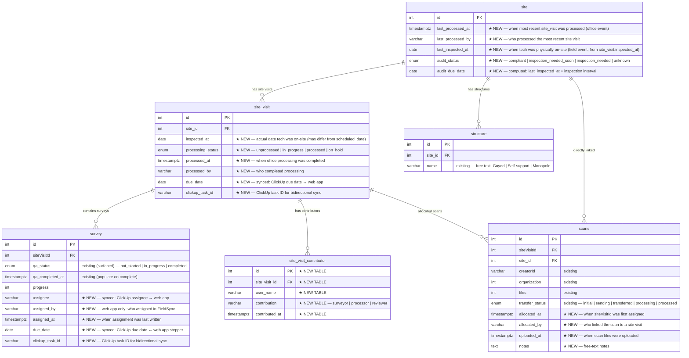

# Database Diagram
## FieldSync QA Operations & Analytics Platform

> **Legend:** Columns marked `★ NEW` are added by this migration. All others are existing. Dashed borders indicate new tables.

---

## Entity Relationship Diagram



---

## Relationship Summary

| From | To | Key | Cardinality | Notes |
|---|---|---|---|---|
| `site` | `site_visit` | `site_visit.site_id` | one-to-many | Full visit history queryable; `site` caches only the most recent |
| `site` | `structure` | `structure.site_id` | one-to-many | Structure type drives audit interval in compliance calculation |
| `site` | `scans` | `scans.site_id` | one-to-many | Direct site linkage independent of site visit allocation |
| `site_visit` | `survey` | `survey.siteVisitId` | one-to-many | Surveys belong to a site visit |
| `site_visit` | `site_visit_contributor` | `site_visit_contributor.site_visit_id` | one-to-many | Junction table for surveyors, processors, reviewers |
| `site_visit` | `scans` | `scans.siteVisitId` | one-to-many | Scans allocated to a site visit |

---

## Denormalized Summary Fields on `site`

`site` stores two distinct summary dates cached from `site_visit`. They are **not the same value** and come from different source fields:

| Column | Source | Meaning | Used For |
|---|---|---|---|
| `last_processed_at` | `site_visit.processed_at` | When office staff last completed processing | Operational tracking — "is this site visit processed?" |
| `last_inspected_at` | `site_visit.inspected_at` | When a technician was last physically on-site | Compliance/audit calculation — `audit_due_date` is computed from this |

> **Why the distinction matters:** A tech may inspect a tower in October but scans aren't processed until December. Using `processed_at` (December) for the audit window makes the tower appear more recently inspected than it was. `audit_due_date` must be based on the field date (`inspected_at`), not the office processing date.

> **Full visit history** is always available via `SELECT * FROM site_visit WHERE site_id = :id ORDER BY processed_at DESC`. The summary fields on `site` are a read-performance cache only — no separate tracking table is needed.

---

## New Tables

### `site_visit_contributor` *(new)*

Junction table replacing a JSONB array. Tracks every person who touched a site visit and in what capacity.

```
site_visit_contributor
├── id                 SERIAL PRIMARY KEY
├── site_visit_id      FK → site_visit.id   ON DELETE CASCADE
├── user_name          VARCHAR(255)
├── contribution       VARCHAR(50)           -- 'surveyor' | 'processor' | 'reviewer'
├── contributed_at     TIMESTAMPTZ DEFAULT NOW()
└── UNIQUE (site_visit_id, user_name, contribution)
```

---

## ClickUp Bidirectional Sync

`survey` and `site_visit` rows are linked to ClickUp tasks via `clickup_task_id`. This enables two-way sync while keeping the DB as the analytics source of truth.

```
ClickUp → DB (inbound via webhook)
  ClickUp task updated
    └── assignee changed    → write survey.assignee, survey.assigned_at
    └── due date changed    → write survey.due_date / site_visit.due_date
    └── status changed      → write survey.qa_status
  Matched by: clickup_task_id

DB → ClickUp (outbound via API)
  Web app action
    └── PM assigns survey   → POST /task/{clickup_task_id} assignees
    └── PM sets due date    → POST /task/{clickup_task_id} due_date
    └── Status marked done  → POST /task/{clickup_task_id} status
  Only fires when: clickup_task_id IS NOT NULL

No ClickUp sync for:
  site.audit_status            — computed field, no PM/tech action
  site_visit.processing_status — internal data pipeline
  site_visit.inspected_at      — field-recorded date, set on processing
  scans.status                 — scan allocation pipeline
```

| Column | Source of truth | DB role |
|---|---|---|
| `survey.assignee` | ClickUp (primary) or web app | Analytics cache + fallback |
| `survey.due_date` | ClickUp (primary) or web app | Analytics cache + fallback |
| `survey.qa_status` | ClickUp (primary) or web app | Analytics cache + fallback |
| `survey.assigned_by` | Web app only | Audit trail (ClickUp does not expose this) |
| `site_visit.inspected_at` | DB only — recorded on processing | Source for `site.last_inspected_at` and audit calculation |
| `site_visit.processing_status` | DB only | Internal pipeline |
| `site.audit_status` | DB only (computed) | Compliance/audit reporting |
| `scans.status` | DB only | Scan allocation tracking |

---

## New Enum Types

| Enum | Values | Used On | Status |
|---|---|---|---|
| `site_visit_status_enum` | `unprocessed`, `in_progress`, `processed`, `on_hold` | `site_visit.processing_status` | ★ New |
| `site_audit_enum` | `compliant`, `inspection_needed_soon`, `inspection_needed`, `unknown` | `site.audit_status` | ★ New |
| `scan_transfer_status_enum` | `initial`, `sending`, `transferred`, `processing`, `processed` | `scans.transfer_status` | Existing — confirm values |

> **Note:** No new enum is needed for `survey` — the existing `qaStatus` column already carries `not_started`, `in_progress`, and `completed`. No new enum is needed for `scans` — `transfer_status` already exists; only a backfill is required.

---

## Computed / Triggered Columns

### `site.audit_status` and `site.audit_due_date`

Auto-computed by a PostgreSQL trigger (`site_audit_trigger`) whenever `site.last_inspected_at` is updated. Resolves the structure type via JOIN to the `structure` table.

```
audit_status logic:
  → JOIN structure ON structure.site_id = site.id → get structure.name
  → if LOWER(name) LIKE '%guyed%'  → interval = 3 years
  → else                           → interval = 5 years  (monopole, self-support, unknown)
  → deadline       = last_inspected_at + interval
  → soon_threshold = deadline - 6 months
  → CURRENT_DATE > deadline        → inspection_needed
  → CURRENT_DATE >= soon_threshold → inspection_needed_soon
  → else                           → compliant
  → last_inspected_at IS NULL      → unknown
```

### `site.last_inspected_at` and `site.last_processed_at`

Both are updated when a site visit is marked processed:
- `last_inspected_at` ← `site_visit.inspected_at` of the most recent site visit (field date)
- `last_processed_at` ← `site_visit.processed_at` of the most recent site visit (office processing date)

Setting `last_inspected_at` triggers the `site_audit_trigger` to recompute `audit_status` and `audit_due_date`.

---

## Migration Execution Order

```
1.  CREATE TYPE site_visit_status_enum
2.  CREATE TYPE site_audit_enum
    (scan_transfer_status_enum already exists — confirm values, no CREATE needed)
3.  ALTER TABLE survey      ADD COLUMN assignee, assigned_by, assigned_at, due_date, clickup_task_id
4.  ALTER TABLE site_visit  ADD COLUMN inspected_at, processing_status, processed_at,
                                       processed_by, due_date, clickup_task_id
5.  CREATE TABLE site_visit_contributor
6.  ALTER TABLE site        ADD COLUMN last_processed_at, last_processed_by,
                                       last_inspected_at, audit_status, audit_due_date
7.  ALTER TABLE scans       ADD COLUMN allocated_at, allocated_by, uploaded_at, notes
                            (transfer_status already exists — backfill only)
8.  CREATE FUNCTION compute_audit_status(...)
9.  CREATE TRIGGER site_audit_trigger ON site
10. Backfill survey         (existing surveys → assignee = NULL; status derived from qaStatus)
11. Backfill site_visit     (existing processed visits → processing_status = 'processed';
                             inspected_at = scheduled_date as best available approximation)
12. Backfill site           (last_processed_at/by from most recent site_visit.processed_at;
                             last_inspected_at from most recent site_visit.inspected_at;
                             recompute audit_status + audit_due_date)
13. Backfill scans          (transfer_status where siteVisitId IS NOT NULL → 'transferred';
                             uploaded_at = created_at where NULL)
14. CREATE INDEX (all tables)
```
